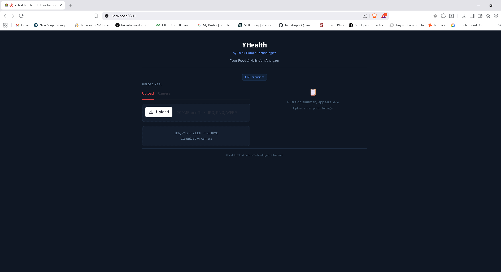
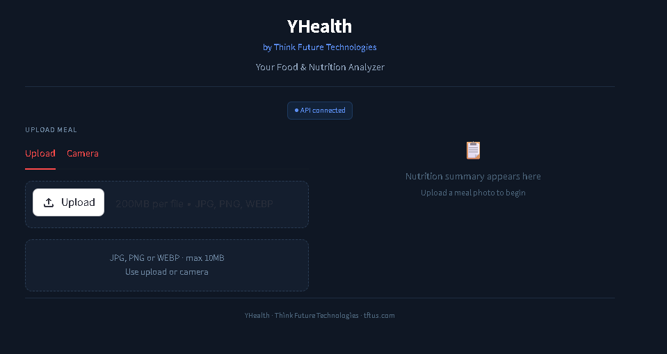
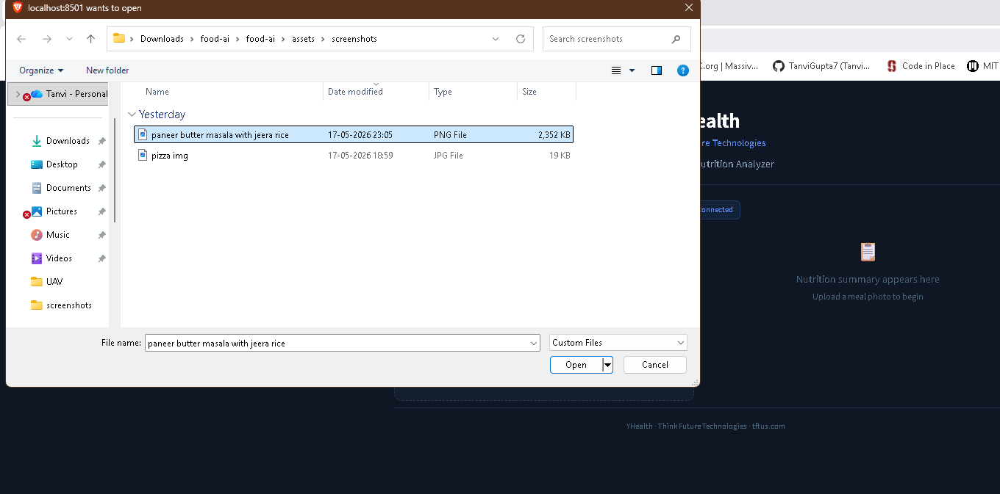
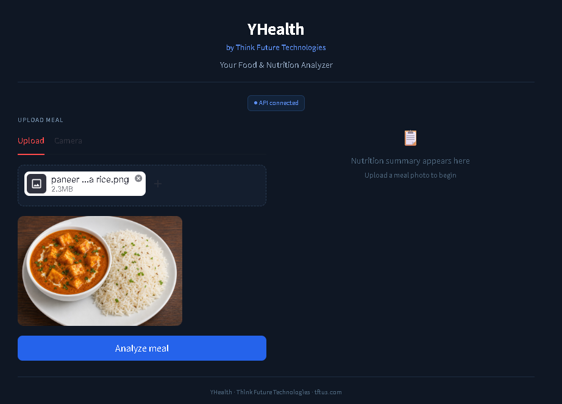
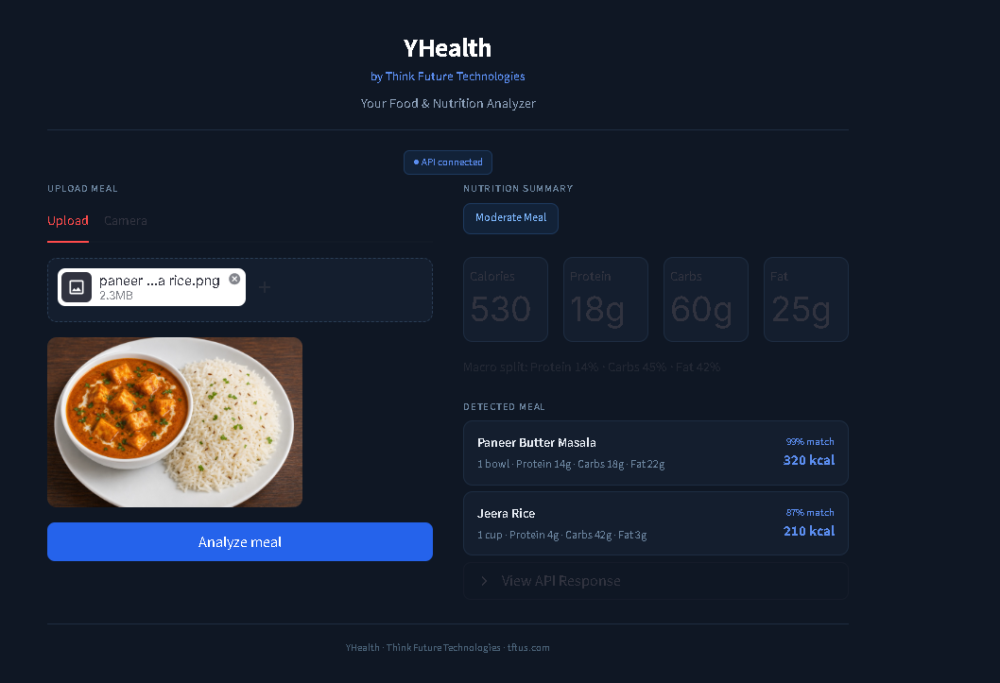
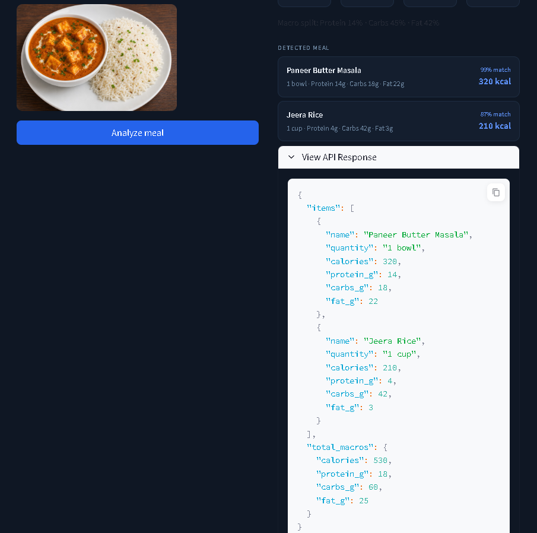

# YHealth

<h1 align="center">YHealth</h1>

<h4 align="center">by Think Future Technologies</h4>

<p align="center">
  Your Food & Nutrition Analyzer
</p>

<p align="center">
  Upload an image of your meal and receive the estimated calorie, protein, carbs and fat counts right away.
</p>

---

# Overview

YHealth is a Food Recognition and Nutrition Analysis Application that recognizes food images and calculates the nutrition macros (calories, protein, carbohydrates, fat) of the meals.

The project combines:
- HuggingFace Vision Transformer (Food-101)
- FastAPI backend
- Streamlit frontend
- Dockerized deployment
- Lightweight meal heuristics
- Nutrition macro estimation

The aim of the project is to develop a demofriendly and useful nutrition analysis system with a light and efficient architecture.

---

# Features

- Upload food images
- Camera capture support
- Vision-based food recognition
- Nutrition macro estimation
- Multi-item meal support
- JSON API response
- Streamlit dashboard UI
- Docker deployment
- Lightweight security protections
A clean and responsive interface.

---

# Quick Start

## Docker Setup

```bash
docker compose up --build
```

Frontend:

```text
http://localhost:8501
```

Backend API:

```text
http://localhost:8000/docs
```

---

# Local Development

## Backend

```bash
cd backend
pip install -r requirements.txt
uvicorn main:app --reload
```

## Frontend

```bash
cd frontend
pip install -r requirements.txt
streamlit run app.py
```

---

# Application Screenshots

## Main Interface

<p align="center">
  
</p>

---

## Food Detection Example

<p align="center">
  
</p>

---

# Working Demo Images

These are some sample images to test meal detection and nutrition analysis within YHealth.

<p align="center">
  
  
  
</p>

<p align="center">
  
  
  
</p>

---

---

# Demo Video

## Watch Application Demo

[▶ Watch Demo Video](assets/videos/DemoAPP_FoodRecognitionAPI.mp4)

---

# How It Works

User takes or uploads a food photo.User takes or uploads a food picture.  
2. Image is sent to the FastAPI backend  
The HuggingFace ViT model is used for food classification task.Using HuggingFace ViT model for food classification task.  
5. The prediction quality is better improved by using lightweight heuristics for the meal.  
The nutrition macros are mapped from the nutrition database:  
7. Calories, protein, carbs and fat are totalled.  
7. Streamlit dashboard and JSON API response will show results.  

---

# Tech Stack

| Layer | Technology |
|---|---|
| Backend | FastAPI |
| Frontend | Streamlit |
Model | huggingface ViT (Food-101) |
| Language | Python |
| Containerization | Docker |
| Deployment | Render / Railway |

---

# Security Features

The project features light security measures for demo and MVP.

## Implemented Security Measures

- Upload size limits
- MIME validation
- File type validation
- Pillow image verification
- Lightweight rate limiting
- Security response headers
- Sanitized rendering
Improved error handling in the API.Better error handling in API.

---

# Project Structure

```text
food-ai/
├── backend/
│   ├── main.py
│   ├── inference.py
│   ├── meal_logic.py
│   ├── nutrition_data.py
│   ├── security.py
│   └── Dockerfile
│
├── frontend/
│   ├── app.py
│   └── streamlit_compat.py
│
├── assets/
│   ├── screenshots/
│   ├── demo_images/
│   └── videos/
│
├── docker-compose.yml
├── render.yaml
├── railway.toml
└── README.md
```

---

# API Response Example

```json
{
  "items": [
    {
      "name": "Paneer Butter Masala",
      "quantity": "1 bowl",
      "calories": 320,
      "protein_g": 14,
      "carbs_g": 18,
      "fat_g": 22
    },
    {
      "name": "Jeera Rice",
      "quantity": "1 cup",
      "calories": 210,
      "protein_g": 4,
      "carbs_g": 42,
      "fat_g": 3
    }
  ],
  "total_macros": {
    "calories": 530,
    "protein_g": 18,
    "carbs_g": 60,
    "fat_g": 25
  }
}
```

---

# Deployment

## Render

Deploy using:
- `render.yaml`
- Use a package registry for front-end services.- Implement package registry for front-end services.

---

## Railway

Deploy:
- Backend service
- Frontend service

Set:

```text
API_URL=<backend-public-url>
```

---

# Notes

The HuggingFace Food-101 model is the base model used in this project.

Lightweight heuristics of food recognition are incorporated to assist with practical food recognition and nutrition estimation without the need to train big deep learning models.

---

# Built With

- FastAPI
- Streamlit
- HuggingFace Transformers
- Docker
- Python

---

# Developed For

## Think Future Technologies

YHealth — Your Food & Nutrition Analyzer
